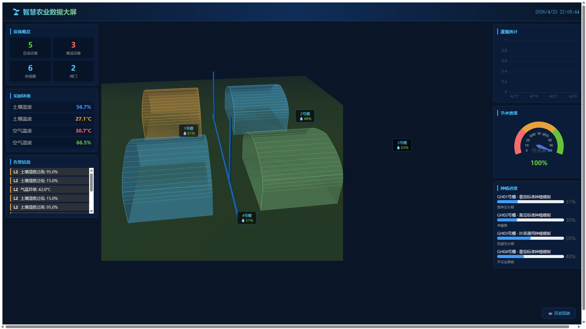
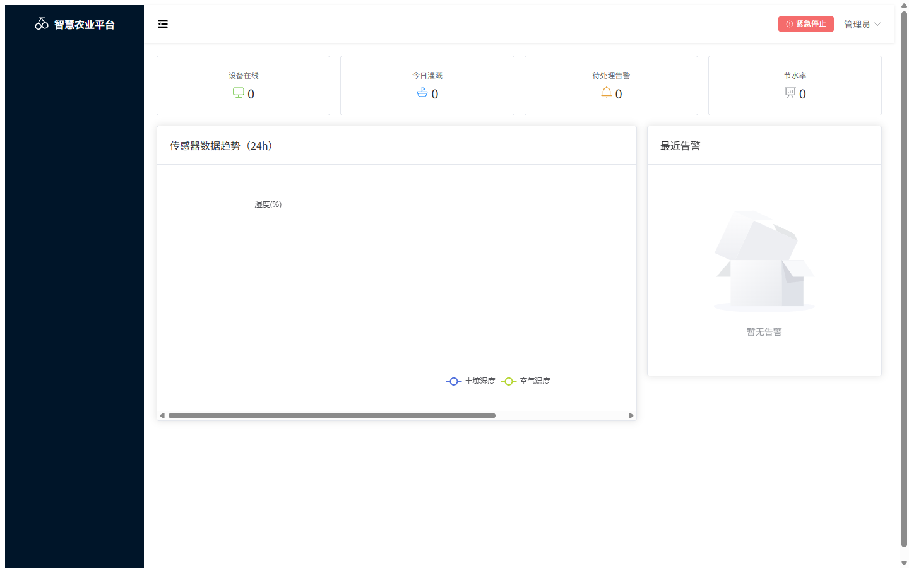
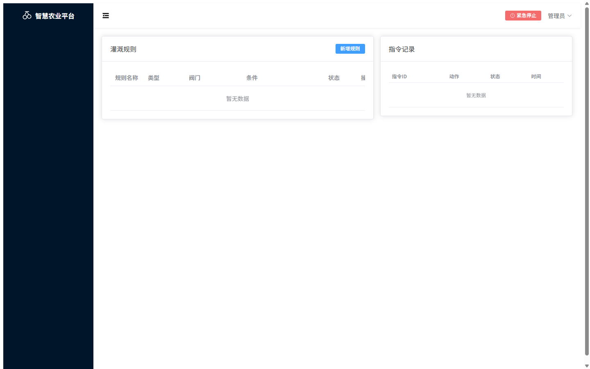

# 🌱 智慧农业平台 Smart Farm

面向设施温室蔬菜种植基地的一体化智慧灌溉解决方案，提供 **设备接入 + 智能灌溉 + 数据驱动决策 + 三端协同（小程序 / PC 管理后台 / 3D 数据大屏）**。

## 功能截图

### 3D 数据大屏
政府示范项目核心交付件，温室三维场景 + 实时数据 + 灌溉动画 + 告警弹窗 + 历史回放。



### 总览仪表盘
设备在线率、今日灌溉、待处理告警、节水率趋势一目了然。



### 设备管理
传感器和阀门设备的注册、查询、状态监控。


### 灌溉管理
灌溉规则配置（阈值触发/定时任务）+ 执行记录查询。



### 告警中心
L1/L2/L3 三级告警，按级别筛选、批量确认。


### 数据报表
灌溉统计、节水率对比、传感器趋势，支持 CSV/Excel/PDF 导出。


## 技术栈

| 组件 | 选型 |
|------|------|
| 后端 | Java 17 + Spring Boot 3.2.5 |
| 数据库 | PostgreSQL + TimescaleDB |
| 消息队列 | EMQX (MQTT Broker) |
| 缓存 | Redis 7 |
| PC 后台 | Vue 3 + Element Plus + ECharts |
| 3D 大屏 | Vue 3 + Three.js + ECharts |
| 小程序 | 微信原生小程序 |
| AI | 通义千问 (Function Calling) |
| 监控 | Prometheus + Grafana |
| 部署 | Docker Compose |

## 项目结构

```
smart-farm/
├── backend/                # Spring Boot 后端 (11个DDD模块)
│   ├── src/main/java/com/smartfarm/
│   │   ├── device/         # 设备管理
│   │   ├── telemetry/      # 遥测数据
│   │   ├── irrigation/     # 智能灌溉 (规则引擎+指令状态机)
│   │   ├── alert/          # 告警通知
│   │   ├── user/           # 用户认证 (JWT)
│   │   ├── crop/           # 作物模板+种植管理
│   │   ├── report/         # 数据报表+导出
│   │   ├── ai/             # AI智能体 (L1对话/L2巡检/L3决策)
│   │   ├── tenant/         # 多租户SaaS
│   │   ├── fertigation/    # 水肥一体化
│   │   └── shared/         # 共享 (安全/天气/大屏API)
│   └── tools/device-simulator/  # 设备模拟器 (Python)
├── frontend/               # Vue3 PC管理后台 (9个页面+3D大屏)
├── miniapp/                # 微信小程序 (6个页面)
├── monitoring/             # Prometheus + Grafana 配置
├── docs/                   # 需求文档 + 截图
└── docker-compose.yml      # 一键部署 (8个容器)
```

## 快速开始

### 环境要求

- Docker 20+ & Docker Compose
- JDK 17+ (本地开发)
- Node.js 20+ (前端开发)

### 一键启动

```bash
git clone <repo-url>
cd smart-farm

# 启动全部服务 (数据库+EMQX+Redis+后端+前端+模拟器+Prometheus+Grafana)
docker compose up -d --build

# 等待约1分钟，访问：
# PC后台:    http://localhost        (admin / admin123)
# 3D大屏:    http://localhost/screen3d
# Swagger:   http://localhost:8080/swagger-ui.html
# Grafana:   http://localhost:3001   (admin / admin123)
# EMQX:      http://localhost:18083  (admin / public)
# Prometheus: http://localhost:9090
```

### 本地开发

```bash
# 启动依赖服务
docker compose up -d postgres emqx redis

# 后端
cd backend
mvn spring-boot:run

# 前端
cd frontend
npm install && npm run dev
```

## 核心功能

### 智能灌溉引擎
- 阈值触发：土壤湿度 < 下限自动开阀，> 上限自动关阀
- 天气联动：下雨自动跳过灌溉，高温自动增加灌溉
- 安全护栏：单次灌溉最长 60 分钟强制关阀
- 指令状态机：CREATED → SENT → CONFIRMED → EXECUTED/FAILED，超时自动重试 3 次

### AI 智能体 (三层架构)
- L1 对话助手：自然语言查数据、控设备（"1号棚湿度多少"、"打开阀门灌20分钟"）
- L2 巡检 Agent：每 30 分钟趋势预判、每 2 小时设备健康检查、每日运营摘要
- L3 自主决策：每周分析历史数据，自动生成灌溉阈值优化建议

### 水肥一体化
- 配方管理：N/P/K 比例、EC/pH 目标值
- 联动执行：同时控制施肥泵 + 灌溉阀

### 数据报表
- 灌溉统计（日/周/月）、节水率对比、告警统计
- 导出：CSV / Excel / 月度 PDF 报告

## API 文档

启动后访问 Swagger UI：`http://localhost:8080/swagger-ui.html`

主要 API 分组：
- 设备管理 `/api/v1/devices`
- 遥测数据 `/api/v1/telemetry`
- 灌溉指令 `/api/v1/commands`
- 灌溉规则 `/api/v1/rules`
- 告警管理 `/api/v1/alerts`
- 数据报表 `/api/v1/reports`
- 作物管理 `/api/v1/crop-templates` `/api/v1/greenhouse-plantings`
- AI 智能体 `/api/v1/ai/chat` `/api/v1/ai/patrol` `/api/v1/ai/suggestions`
- 水肥一体化 `/api/v1/fertigation`
- 租户管理 `/api/v1/tenants`
- 大屏数据 `/api/v1/screen/data`

## 环境变量

| 变量 | 默认值 | 说明 |
|------|--------|------|
| DB_PASSWORD | smartfarm123 | 数据库密码 |
| JWT_SECRET | (内置开发密钥) | JWT 签名密钥 |
| GRAFANA_PASSWORD | admin123 | Grafana 密码 |
| AI_LLM_API_KEY | (空) | 通义千问 API Key |
| AI_LLM_MODEL | qwen-plus | AI 模型名称 |

## License

MIT
